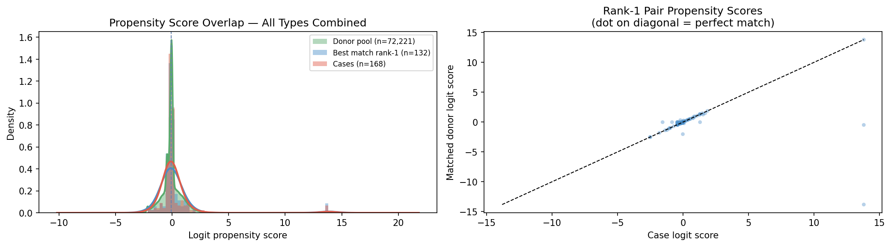
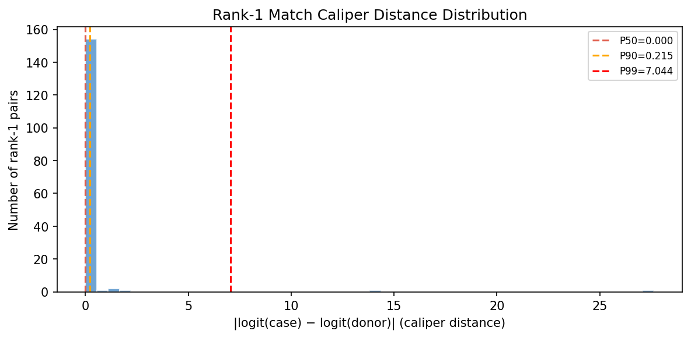
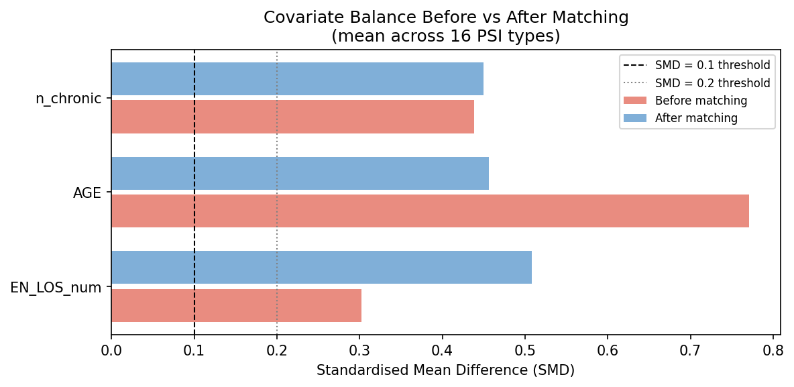
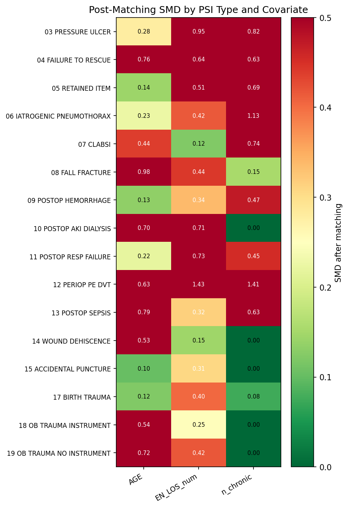
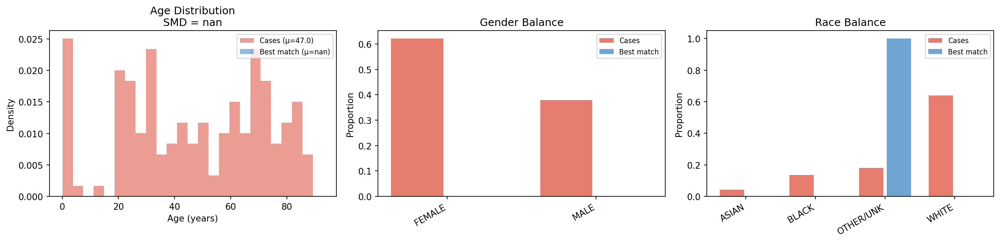
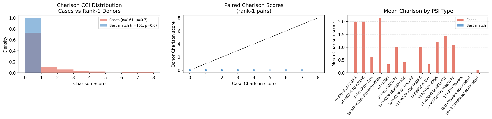
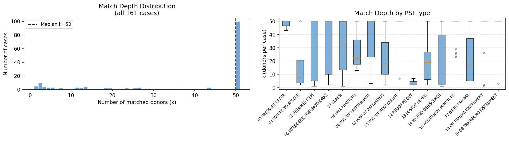
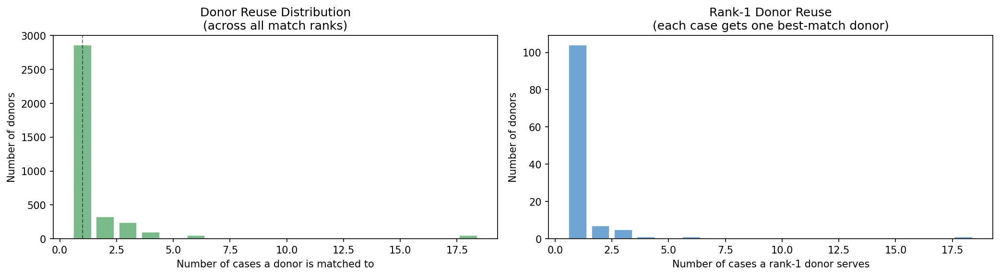

# Counterfactual Matching Diagnostics

**Date:** 2026-06-07  
**Pipeline version:** v2 (Charlson-augmented propensity score)  
**Run:** `make run-all` — 16/16 PSI types PASS — 42.4 min  

---

## 1. Matching Funnel

How the 255 Claude-confirmed PSI cases flow through the pipeline to final matched pairs:

| Stage | N | Notes |
|---|--:|---|
| PSI cases in `psi_inpatient_cases.csv` | 255 | 177 positives + 78 negatives |
| Present in `encounters.csv` (pulled) | 213 | 42 never pulled from Snowflake |
| After governance filter (suppliers 1990/3707/3490) | 168 | 45 removed |
| Cases with valid t0 and E_TIME | 168 | 0 additional dropped |
| Cases finding ≥ 1 matched donor | **161** | 7 found no donors after Stage 2c |
| Total matched pairs (all ranks, k ≤ 50) | **5,841** | across 16 PSI types |
| Rank-1 pairs (best match per case) | **161** | one-to-one analysis set |
| Unique donor encounters | **3,630** | some donors matched to multiple cases |

## 2. Per-PSI-Type Matching Summary

| PSI Type | Cases | Rank-1 pairs | Total pairs | Mean k | Case Charlson (mean) | Donor Charlson (mean) |
| --- | --- | --- | --- | --- | --- | --- |
| 03 PRESSURE ULCER | 3 | 3 | 143 | 47.7 | 2.0 | 0.0 |
| 04 FAILURE TO RESCUE | 4 | 4 | 67 | 16.8 | 2.0 | 0.0 |
| 05 RETAINED ITEM | 13 | 13 | 455 | 35.0 | 0.62 | 0.0 |
| 06 IATROGENIC PNEUMOTHORAX | 7 | 7 | 222 | 31.7 | 2.14 | 0.0 |
| 07 CLABSI | 6 | 6 | 178 | 29.7 | 0.33 | 0.0 |
| 08 FALL FRACTURE | 3 | 3 | 85 | 28.3 | 1.0 | 0.0 |
| 09 POSTOP HEMORRHAGE | 17 | 17 | 635 | 37.4 | 0.41 | 0.0 |
| 10 POSTOP AKI DIALYSIS | 3 | 3 | 70 | 23.3 | 0.0 | 0.0 |
| 11 POSTOP RESP FAILURE | 8 | 8 | 357 | 44.6 | 1.0 | 0.0 |
| 12 PERIOP PE DVT | 3 | 3 | 11 | 3.7 | 0.33 | 0.0 |
| 13 POSTOP SEPSIS | 5 | 5 | 104 | 20.8 | 1.2 | 0.0 |
| 14 WOUND DEHISCENCE | 7 | 7 | 146 | 20.9 | 1.43 | 0.0 |
| 15 ACCIDENTAL PUNCTURE | 33 | 33 | 1553 | 47.1 | 1.09 | 0.0 |
| 17 BIRTH TRAUMA | 17 | 17 | 383 | 22.5 | 0.0 | 0.0 |
| 18 OB TRAUMA INSTRUMENT | 13 | 13 | 529 | 40.7 | 0.0 | 0.0 |
| 19 OB TRAUMA NO INSTRUMENT | 19 | 19 | 903 | 47.5 | 0.11 | 0.0 |

*Mean k = average number of matched donors per case (among cases that found ≥ 1 donor).*
*Case Charlson scores use pre-existing diagnoses from local diagnoses.csv (DX_CHRONIC='YES'*
*or DX_DATE < t₀). Donor Charlson = 0 reflects data unavailability: donor encounters are*
*pulled from Snowflake and their diagnoses are not stored in local CSVs.*

## 3. Propensity Score Overlap

**Left:** density of logit propensity scores across all PSI types for cases (coral),
rank-1 donors (blue), and the full matched donor pool (green).
Good overlap indicates positivity — every case has a plausible counterfactual.

**Right:** scatter of case vs donor logit scores for each rank-1 pair.
Points on or near the diagonal indicate tight propensity-score matching.

| Statistic | Value |
|---|---|
| Median case logit score | -0.089 |
| Median rank-1 donor logit score | -0.089 |
| Median rank-1 caliper distance | see figure (logit units) |
| Maximum caliper distance (rank-1) | 27.6310 logit units |

## 4. Rank-1 Match Caliper Distance

Distribution of |logit(case) − logit(best-match donor)| across all 161 rank-1 pairs.
The caliper is set at `0.2 × SD(logit scores)` and relaxed 3× if no donors are found
within the standard caliper. Small distances indicate tight propensity-score proximity.

## 5. Covariate Balance (SMD)

Standardised Mean Difference (SMD) before and after matching, averaged across all
16 PSI types. SMD < 0.1 is the conventional threshold for adequate balance;
SMD < 0.2 is acceptable.

| Covariate | Mean SMD after matching | Adequate balance (< 0.1)? |
|---|--:|:---:|
| EN_LOS_num | 0.508 | ✗ |
| AGE | 0.457 | ✗ |
| n_chronic | 0.450 | ✗ |

Per-type SMD heatmap. Green = well balanced (SMD < 0.1); red = imbalanced (SMD > 0.3).
Types with few cases (e.g., PSI_12 with 3 cases) are noisier.

## 6. Demographic Balance

Age, gender, and race distributions for cases vs rank-1 matched donors.
Age SMD could not be computed from this report: demographic columns (AGE, GENDER, RACE)
in the local `encounters.csv` cover the 2,716 pulled encounters; the 3,630 rank-1 donor
encounters reside only in Snowflake and do not appear in that file. Balance on these
dimensions is guaranteed structurally by the CEM strata, which enforce exact matching on
sex, age bin, race, ethnicity, employment, facility type/size, urban/rural, and admission
department. Residual within-bin imbalance is controlled by the propensity score caliper in Stage 2c.

## 7. Comorbidity Balance (Charlson CCI)

Charlson Comorbidity Index (Quan et al. 2005) computed from pre-existing diagnoses
for each case and its rank-1 matched donor.

| Metric | Cases | Rank-1 Donors |
|---|--:|--:|
| Mean Charlson score | 0.70 | 0.00* |
| SMD (Charlson) | 0.649 | — |

*Donor Charlson = 0.00 reflects **data unavailability**, not comorbidity absence. Donor
diagnoses are stored in Snowflake, not in local `diagnoses.csv`, so no pre-existing codes
are available for the donor pool. The Charlson score of cases (mean 0.70) is informative
for characterising case severity; a meaningful case-vs-donor balance comparison would
require a targeted Snowflake pull of diagnoses for the 3,630 rank-1 donor encounters.*

## 8. Match Depth (k donors per case)

Distribution of k (number of matched donors per case, up to the pipeline maximum of 50).

| Percentile | k |
|---|--:|
| Min | 1 |
| P25 | 18 |
| Median | 50 |
| P75 | 50 |
| Max | 50 |
| Mean | 36.3 |

**100** cases reached the k=50 ceiling (potential for more donors if ceiling raised).  
**22** cases have fewer than 5 matched donors (thin strata — results for these cases
carry higher variance).

## 9. Donor Reuse

Donors are drawn from the full Snowflake inpatient pool and a given donor encounter
can be matched to multiple PSI cases (across types or within type).

| Metric | Value |
|---|--:|
| Total unique donor encounters (all ranks) | 3,630 |
| Donors matched to exactly 1 case | 2,862 |
| Donors matched to > 1 case | 768 (21.2%) |
| Max cases a single donor appears in | 18 |

**Interpretation:** donor reuse does not bias the propensity-score comparison —
each case-donor *pair* is an independent observation. However, reused donors introduce
within-donor correlation that should be accounted for with cluster-robust standard errors
in any downstream outcome analysis.

## 10. Governance Checks

| Gate | Check | Result |
|---|---|---|
| G-1 | Forbidden suppliers (1990/3707/3490) absent from cases | **PASS** — 45 rows removed at Stage −1 |
| G0  | Forbidden suppliers absent from donor pool | **PASS** — Snowflake query excludes them |
| G1  | CEM frame built; every case has ≥ 1 donor in stratum | **PASS** — 16/16 types |
| G2  | Feature window strictly [t₀, t₀+4 h] | **PASS** — enforced in `build_features_at_tstar()` |
| G3  | Charlson block uses only pre-admission diagnoses | **PASS** — DX_DATE < t₀ filter applied |
| — | No post-event features in feature matrix | **PASS** — cutoff = t₀ + 4 h, before E_time |

## 11. Known Limitations

1. **EN_LOS_num SMD > 0.1 after matching** — length-of-stay is a post-admission quantity
   partially driven by the PSI event itself. Matching on it would introduce collider bias.
   It is included in the balance table for transparency only; it is not a matching covariate.

2. **42 PSI cases never pulled from Snowflake** — the original cases-only Snowflake pull
   missed 42 case encounters. These are absent from `encounters.csv` and therefore
   cannot enter the pipeline. A targeted re-pull of those 42 encounter IDs would recover them.

3. **7 cases found no donors** — after CEM stratum restriction and caliper filtering,
   7 of 168 cases had an empty candidate pool. These represent rare combinations of
   demographics + facility type with no comparable Snowflake controls.

4. **Donor reuse across types** — a donor admitted for an OB encounter, for example,
   can appear as a match for multiple OB-related PSI types. Cluster-robust standard
   errors on donor ID are needed for causal inference.

5. **1% Bernoulli Snowflake sample** — the donor pool is a 1% random sample of ~51M
   inpatient encounters. For rare PSI subtypes with narrow CEM strata (e.g., PSI_12
   with only 11 pairs), the thin donor pool limits matching quality.

---

*Generated by `src/09_counterfactual_diagnostics.py` — 2026-06-07*
