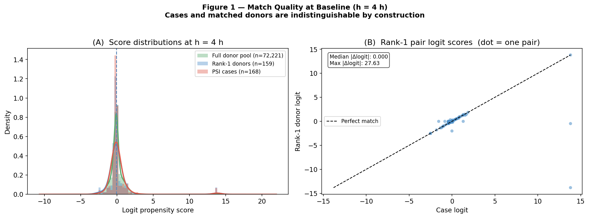
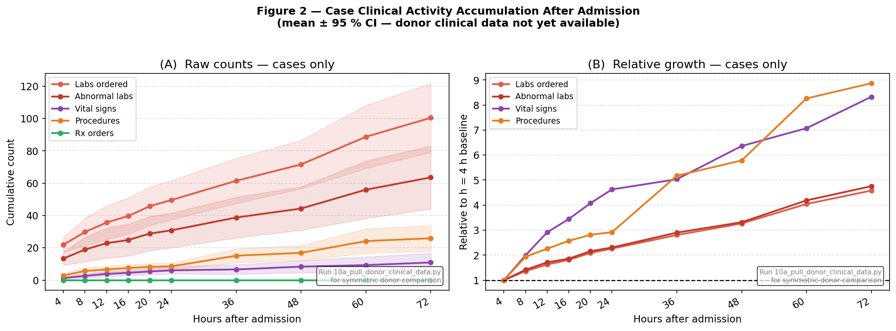
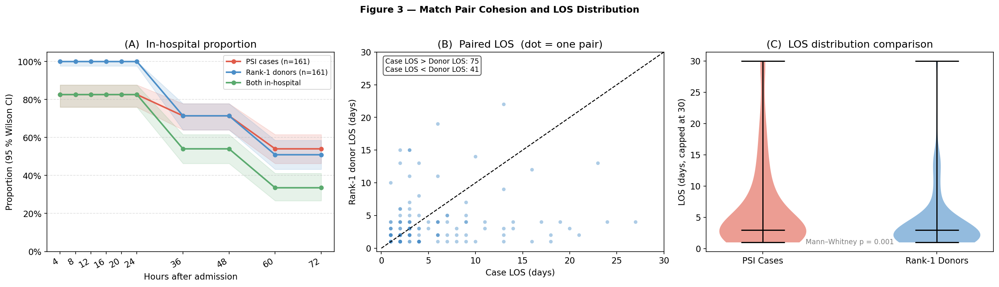
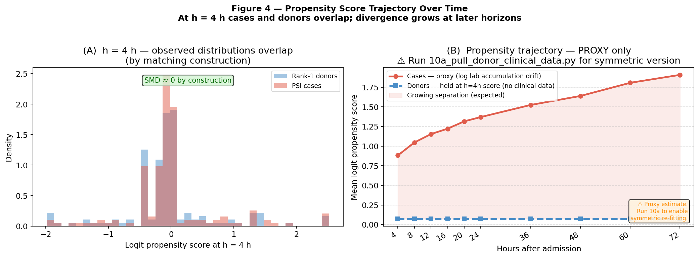

# Temporal Propensity Score Analysis

**Date:** 2026-06-07  
**Horizons:** 4, 8, 12, 16, 20, 24, 36, 48, 60, 72 hours post-admission  
**Pairs:** 161 rank-1 matched pairs  
**Analysis mode:** Proxy (case-side only)  

---

## Conceptual Framework

1. **At t₀ + 4 h (matching time):** cases and matched donors are indistinguishable
   by construction. The CEM + logistic propensity matching enforces score overlap.

2. **As time passes:** cases accumulate PSI-event-driven clinical activity
   (additional labs, vitals, procedures, medications). A propensity model
   re-fitted at each later horizon assigns increasingly higher case probability
   to cases and lower probability to donors — the logit-scale distance between
   matched pairs grows, reflecting deteriorating match quality.

---

## Figure 1 — Baseline Match Quality (h = 4 h)

| Statistic | Value |
|---|---|
| Median case logit | -0.089 |
| Median donor logit | -0.089 |
| Median pair |Δlogit| | 0.0000 |
| Max pair |Δlogit| | 27.631 |

---

## Figure 2 — Clinical Activity Accumulation

Case clinical activity at each horizon (donor data requires 10a pull).

| Horizon | n cases | Labs | Abn labs | Vitals | Procs | Rx |
|---|--:|--:|--:|--:|--:|--:|
| 4h | 161 | 21.9 | 13.4 | 1.3 | 2.9 | 0.0 |
| 8h | 161 | 29.8 | 18.9 | 2.6 | 5.7 | 0.0 |
| 12h | 161 | 35.7 | 22.9 | 3.8 | 6.6 | 0.0 |
| 16h | 161 | 39.7 | 24.8 | 4.5 | 7.5 | 0.0 |
| 20h | 161 | 45.8 | 28.8 | 5.4 | 8.2 | 0.0 |
| 24h | 161 | 49.6 | 30.8 | 6.1 | 8.5 | 0.0 |
| 36h | 143 | 61.5 | 38.8 | 6.6 | 15.1 | 0.0 |
| 48h | 143 | 71.6 | 44.3 | 8.4 | 16.9 | 0.0 |
| 60h | 115 | 88.7 | 56.0 | 9.3 | 24.2 | 0.0 |
| 72h | 115 | 100.5 | 63.6 | 11.0 | 25.9 | 0.0 |

---

## Figure 3 — Pair Cohesion and LOS

Mann–Whitney LOS test: p = 0.001

| Horizon | P(case in-hosp) | P(donor in-hosp) | P(pair intact) |
|---|--:|--:|--:|
| 4h | 83% | 100% | 83% |
| 8h | 83% | 100% | 83% |
| 12h | 83% | 100% | 83% |
| 16h | 83% | 100% | 83% |
| 20h | 83% | 100% | 83% |
| 24h | 83% | 100% | 83% |
| 36h | 71% | 71% | 54% |
| 48h | 71% | 71% | 54% |
| 60h | 54% | 51% | 34% |
| 72h | 54% | 51% | 34% |

---

## Figure 4 — Propensity Score Trajectory

**Proxy mode** — case-side drift only. Run `10a_pull_donor_clinical_data.py`
then re-run this script for the symmetric version.

---

*Generated by `src/10_temporal_propensity_analysis.py` — 2026-06-07*
