# Timestamp Distribution Analysis

**Date:** 2026-06-07  
**Cohort:** 106 cases  |  91 best-match donors (rank 1)  |  2695 extended-pool donors (rank 2+) across 16 PSI types  
**Time zero (t₀):** encounter admission (`EN_START_DATE + EN_START_TIME`)  
**Units:** hours elapsed from t₀  

---

## Groups

Each plot shows up to three non-overlapping groups drawn from `results/tables/all_matched_pairs.csv`:

| Group | Color | Encounters | In raw tables | Description |
|---|---|---|---|---|
| **Case** | 🟥 Coral | 106 | 106 | Inpatient encounters where a PSI adverse event was confirmed by Claude chart review. These are the observations of interest. |
| **Best Match (rank 1)** | 🟦 Blue | 91 | 87 | The single closest-matching control encounter per case, selected by the propensity-score nearest-neighbour matching in Stage 2c. One donor per case (`match_rank = 1` in `all_matched_pairs.csv`). |
| **All Matches (rank 2+)** | 🟩 Green | 2695 | 2417 | The remaining matched controls for each case (`match_rank ≥ 2`), up to k = 50 donors per case. Together with **Best Match**, these form the complete counterfactual pool from `all_matched_pairs.csv` (2,786 unique donor encounters total). |

**Design note:** the three groups are non-overlapping by construction. Rank-1 donors appear only in *Best Match*; rank 2–50 donors appear only in *All Matches (rank 2+)*. An encounter that is a case is never used as a donor in the same analysis. Combining *Best Match* + *All Matches* recovers the full counterfactual pool.

---

## What are the 106 counterfactuals?

The **106** is the number of **rank-1 matched pairs** from `results/tables/all_matched_pairs.csv` — one best-matched counterfactual encounter per PSI case. Each pair is a case (a patient who experienced a PSI adverse event) linked to its single closest control encounter (a patient who did not experience that event but was otherwise similar). Script `07_timestamp_distribution_analysis.py` uses only rank-1 pairs for its plots.

Why 106 and not 110? The run-all summary reports 110 total cases across the 16 PSI types after governance filtering (forbidden suppliers 1990, 3707, 3490 removed from the 177 Claude-confirmed positives in `psi_inpatient_cases.csv`). 4 of those 110 cases found zero matching donors and therefore have no entry in `all_matched_pairs.csv`. 110 − 4 = **106**.

### How were these observations selected — full pipeline

**`src/00_pull_psi_tables.py`** — Pulls inpatient encounter data for PSI-flagged patients from Snowflake into `data/raw/psi_tables/`. Re-run after matching to also include donor encounter IDs so that counterfactual clinical records are available.

**`src/01_psi_pipeline.py`** — PSI detection in three stages:
- **Stage A+B (SQL):** For each of the 16 AHRQ Part-1 PSI definitions, encounters are filtered by ICD-10 regex against `OMNY_DIAGNOSES_ENCOUNTERS`, then the linked clinical note must match a secondary keyword regex. Up to 200 candidates per PSI type are sampled.
- **Stage C (Claude chart review):** Each candidate note is sent to `claude-sonnet-4-6`, which returns structured JSON. A candidate is **confirmed positive** if Claude answers `psi_event_present=YES`, `hospital_acquired_not_poa=YES/UNCERTAIN`, `is_exclusion=NO`, `confidence=HIGH`. Negatives require HIGH confidence + `psi_event_present=NO`.
- **Balanced selection:** Up to 5 positives + 5 negatives per PSI type are retained → `data/raw/psi_inpatient_cases.csv` (255 rows: 177 positive, 78 negative).

**`src/02_counterfactual_pipeline.py`** — Matching pipeline, run once per PSI type by `src/03_run_all_psi_types.py`:
- **Stage −1 (cases.csv):** The 145 raw encounters are governance-filtered (forbidden suppliers 1990, 3707, 3490 removed) → 110 encounters. PSI metadata is joined, `t0` (admission) and `E_time` (PSI event, from ICD-10 diagnosis date or note date fallback) are parsed, and the event landmark `t_star = E_i − 6` is computed (where `E_i` is the 4-hour grid tick of the event, and 6 ticks = 24-hour lookback window).
- **Stage 0 (donor pool):** Snowflake is queried for all inpatient encounters not in the case list using 1% Bernoulli sampling of the ~51M-row `OMNY_REPL_ID.CUSTOM.ENCOUNTERS` table, with forbidden suppliers excluded.
- **Stage 1 (Coarsened Exact Matching — CEM):** Each encounter is binned on 10 dimensions (sex, age, race, ethnicity, employment, facility type, facility size, urban/rural, admission department, current department) to form a CEM stratum key. Donors are only eligible to match a case if they share the same stratum.
- **Stage 2a (feature matrix):** Clinical records in the **[t₀, t₀+4 h]** window are extracted for cases and matched-strata donors (labs, vitals, procedures, Rx orders, diagnoses). Each encounter becomes a sparse feature vector. The 4-hour cutoff enforces the no-post-event-leakage rule.
- **Stage 2b (LSPS — propensity score):** An L1 logistic regression (`SGDClassifier`) is trained on the feature matrix (label: 1=case / 0=donor). The logit-scale score is the matching distance metric.
- **Stage 2c (K:1 nearest-neighbor matching):** For each case a **risk set** is formed from donors still admitted at `t_star` (`grid_LOS > t_star`), restricted to the case's CEM stratum. The caliper is `0.2 × SD(logit scores)` (relaxed 3× if needed). The top k=50 closest donors within the caliper are selected and saved as ranked matched pairs.

**`src/03_run_all_psi_types.py`** — Invokes `02` for all 16 PSI types and aggregates results into `results/tables/all_matched_pairs.csv` (3,615 rows: up to 50 donors per case × 106 matched cases).

**`src/07_timestamp_distribution_analysis.py`** — Reads `all_matched_pairs.csv`, keeps only **rank-1** pairs (the single best-matched donor per case) → **106 case–counterfactual pairs** across 16 PSI types, then plots clinical event timestamps relative to `t₀` for both groups.

---

## Pipeline Funnel: Observations at Each Stage

### Aggregate funnel (all 16 PSI types combined)

| Stage | Description | N |
|---|---|---|
| **Stage A+B — SQL screening** | ICD-10 regex candidates sampled from Snowflake `ENCOUNTERS` (1% Bernoulli, ~51M rows); up to 200 per PSI type × 16 types | ≤ 3,200 candidates |
| **Stage C — Claude chart review** | Candidates confirmed by `claude-sonnet-4-6`; retained in `data/raw/psi_inpatient_cases.csv` | **255** (177 PSI+, 78 PSI−) |
| **Stage −1 input** | Encounters with clinical data pulled via `src/00_pull_psi_tables.py` (`data/raw/psi_tables/encounters.csv`) | **145** |
| **Stage −1 governance filter** | Forbidden suppliers (1990, 3707, 3490) removed | 35 removed → **110** remain |
| **Stage 0 — donor pool** | All inpatient encounters from Snowflake excluding cases (1% Bernoulli sample, forbidden suppliers excluded) | **316,338** |
| **Stage 0 — risk set at t\*** | Donors still admitted at `t_star = 1` (first 4-hour grid tick) | **188,890** |
| **Stage 1 — CEM** | Donors surviving coarsened exact matching to a case stratum (sum across 16 types; strata overlap across types) | **66,863** donor-slots |
| **Stage 2c — matched pairs** | Nearest-neighbour pairs written to `all_matched_pairs.csv` (up to k=50 per case) | **3,615** pairs; 4 cases found zero donors |
| **Final analysis set** | Cases with ≥1 matched donor; rank-1 pairs used for timestamp analysis | **106** cases / **91** unique rank-1 donors |

### Per-PSI type funnel (Stage −1 → Stage 1 CEM → Stage 2c)

| PSI Type | Cases (Stage −1) | CEM Donors (Stage 1) | Matched Pairs (Stage 2c) |
|---|--:|--:|--:|
| PSI_03_PRESSURE_ULCER | 3 | 30,090 | 150 |
| PSI_04_FAILURE_TO_RESCUE | 5 | 788 | 76 |
| PSI_05_RETAINED_ITEM | 13 | 2,425 | 507 |
| PSI_06_IATROGENIC_PNEUMOTHORAX | 7 | 1,138 | 223 |
| PSI_07_CLABSI | 6 | 2,853 | 147 |
| PSI_08_FALL_FRACTURE | 3 | 1,797 | 73 |
| PSI_09_POSTOP_HEMORRHAGE | 11 | 4,327 | 428 |
| PSI_10_POSTOP_AKI_DIALYSIS | 3 | 1,742 | 74 |
| PSI_11_POSTOP_RESP_FAILURE | 8 | 3,340 | 265 |
| PSI_12_PERIOP_PE_DVT | 3 | 93 | 11 |
| PSI_13_POSTOP_SEPSIS | 5 | 1,548 | 78 |
| PSI_14_WOUND_DEHISCENCE | 7 | 1,571 | 150 |
| PSI_15_ACCIDENTAL_PUNCTURE | 14 | 9,517 | 700 |
| PSI_17_BIRTH_TRAUMA | 7 | 1,011 | 117 |
| PSI_18_OB_TRAUMA_INSTRUMENT | 11 | 2,485 | 416 |
| PSI_19_OB_TRAUMA_NO_INSTRUMENT | 4 | 2,138 | 200 |
| **Total** | **110** | **66,863** | **3,615** |

**Notes:**
- CEM donor counts are per-type; the same Snowflake encounter can appear in multiple types' matched strata (i.e. the 66,863 sum double-counts donors shared across PSI types). The unique donor pool size across all matched pairs is **2,787** unique donor encounter IDs.
- 4 cases (PSI_06: 1, PSI_17: 2, PSI_18: 1) found zero donors after Stage 2c and are absent from `all_matched_pairs.csv`, reducing 110 → 106.
- PSI_12_PERIOP_PE_DVT had only 93 CEM-matched donors (the smallest stratum), resulting in only 11 matched pairs across 3 cases.

---

## Summary Dashboard

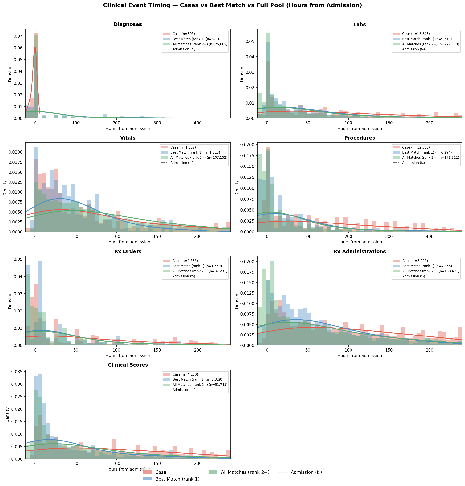

All clinical domains. X-axis = hours from admission. Coral = cases, blue = counterfactuals. Dashed line = admission (t₀ = 0).

## Diagnoses

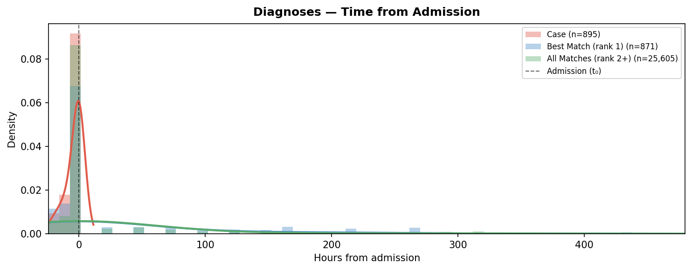

Distribution of diagnosis timestamps relative to admission (t₀). Negative values indicate diagnoses recorded before the encounter start time.

## Labs

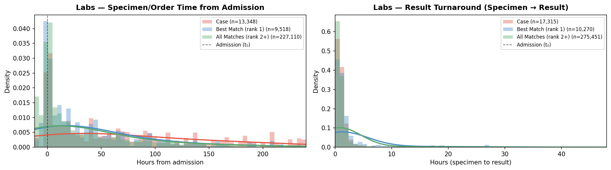

Left: lab order/specimen time from admission. Right: turnaround time from specimen collection to result.

## Labs by Category

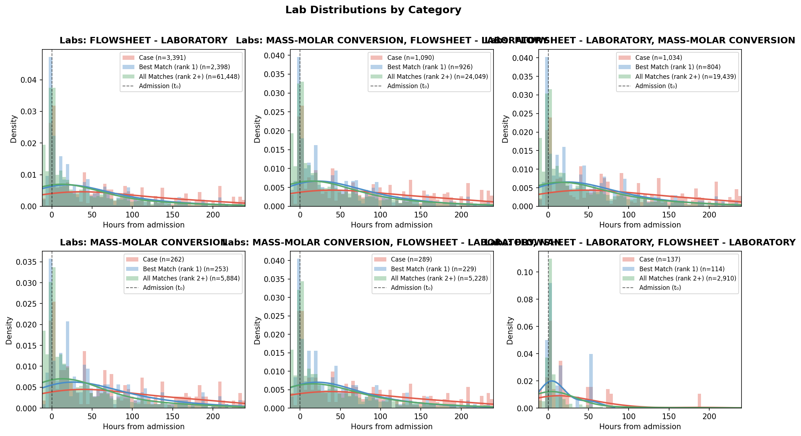

Lab timestamp distributions split by LOINC Level-2 category (top 6 categories by event count).

## Vitals

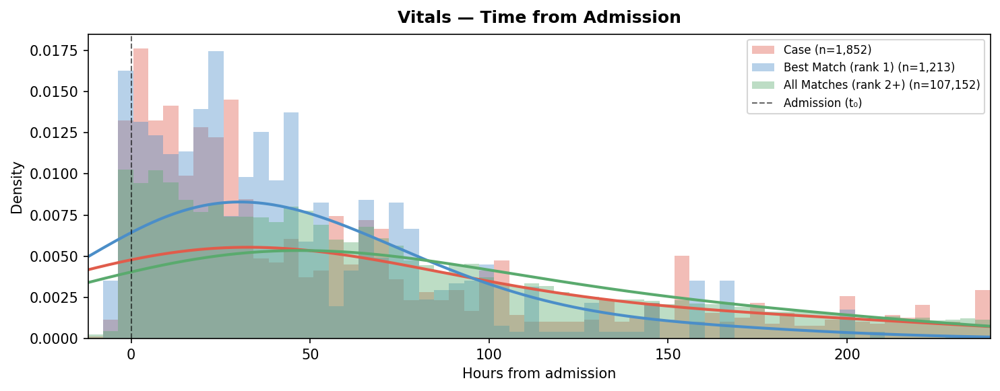

Distribution of vital sign recording times relative to admission.

## Vitals by Type

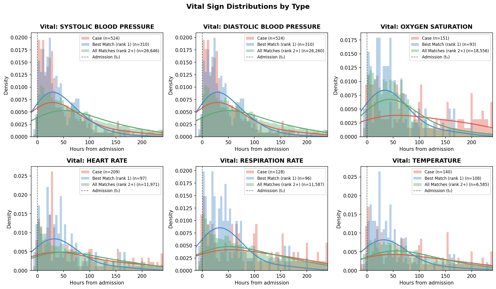

Vital sign timestamp distributions for the top 6 vital types.

## Procedures

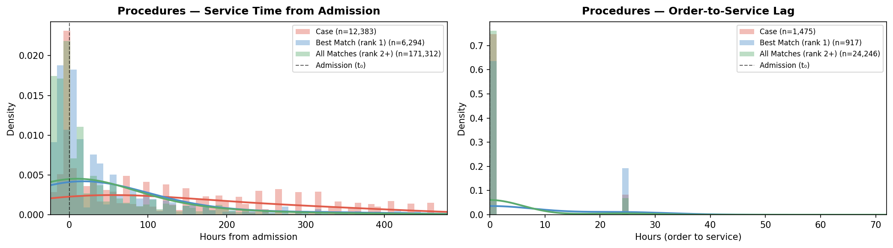

Left: procedure service time from admission. Right: order-to-service lag (0–72 h).

## Prescription Orders

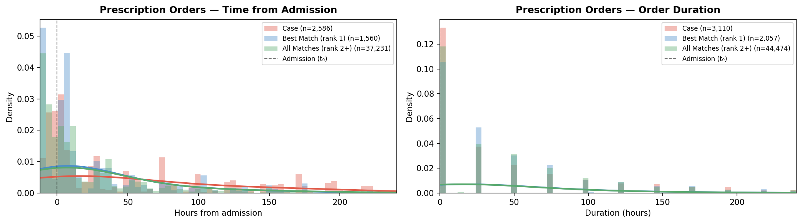

Left: prescription order time from admission. Right: order duration (start to end, capped at 240 h).

## Medication Administrations

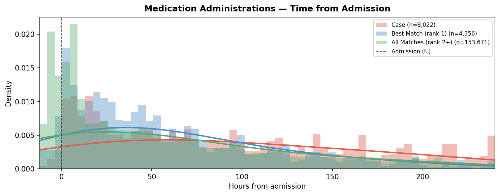

Distribution of medication administration times relative to admission.

## Clinical Scores & Medical Devices

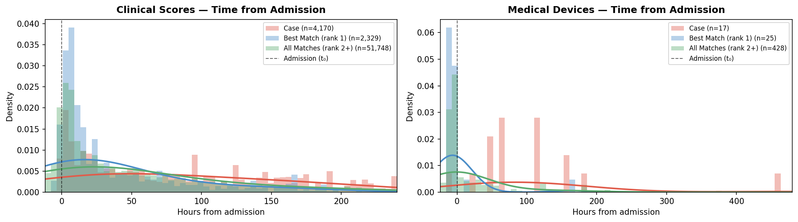

Timestamp distributions for clinical scores and medical device implants.

## First 4 Hours (Feature Window)

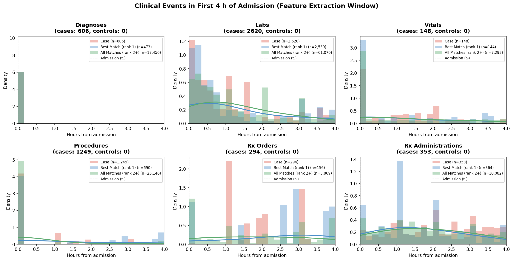

Zoomed view of the [t₀, t₀+4 h] window used by the propensity model to build the feature matrix.

---

## Event Count Summary

| Domain | Group | N events | N events (0–4 h) | Median (h) | P25 (h) | P75 (h) |
| --- | --- | --- | --- | --- | --- | --- |
| Diagnoses | Case | 895 | 606 | 0.0 | -6.3 | 0.0 |
| Diagnoses | Best Match (rank 1) | 871 | 473 | 0.0 | 0.0 | 0.0 |
| Diagnoses | All Matches (rank 2+) | 30113 | 17456 | 0.0 | 0.0 | 48.0 |
| Labs | Case | 18236 | 2620 | 92.0 | 16.7 | 257.1 |
| Labs | Best Match (rank 1) | 10702 | 2539 | 24.0 | 1.8 | 87.7 |
| Labs | All Matches (rank 2+) | 285233 | 61070 | 17.0 | 0.6 | 108.2 |
| Vitals | Case | 3351 | 148 | 172.0 | 29.4 | 556.0 |
| Vitals | Best Match (rank 1) | 1259 | 144 | 37.0 | 15.5 | 69.0 |
| Vitals | All Matches (rank 2+) | 126903 | 7293 | 71.7 | 29.1 | 163.1 |
| Procedures | Case | 14309 | 1249 | 113.7 | 5.2 | 293.2 |
| Procedures | Best Match (rank 1) | 6485 | 690 | 12.1 | 0.0 | 77.6 |
| Procedures | All Matches (rank 2+) | 237578 | 25146 | 35.1 | -0.0 | 920.0 |
| Rx Orders | Case | 3598 | 294 | 26.0 | -0.8 | 169.0 |
| Rx Orders | Best Match (rank 1) | 2368 | 156 | 2.6 | -13.2 | 24.0 |
| Rx Orders | All Matches (rank 2+) | 52286 | 3869 | 1.3 | -11.1 | 36.0 |
| Rx Administrations | Case | 14569 | 353 | 204.2 | 65.8 | 452.0 |
| Rx Administrations | Best Match (rank 1) | 5811 | 364 | 68.4 | 23.5 | 238.4 |
| Rx Administrations | All Matches (rank 2+) | 228900 | 10082 | 81.8 | 11.5 | 664.7 |
| Clinical Scores | Case | 5741 | 331 | 116.6 | 31.8 | 265.0 |
| Clinical Scores | Best Match (rank 1) | 2406 | 411 | 16.1 | 5.2 | 60.2 |
| Clinical Scores | All Matches (rank 2+) | 59847 | 6934 | 36.5 | 6.0 | 114.9 |
| Medical Devices | Case | 18 | 0 | 90.4 | 50.1 | 147.1 |
| Medical Devices | Best Match (rank 1) | 25 | 0 | -7.9 | -8.1 | -5.0 |
| Medical Devices | All Matches (rank 2+) | 435 | 7 | -5.6 | -7.6 | 24.0 |

*N events (0–4 h): events within the propensity model feature extraction window.*
